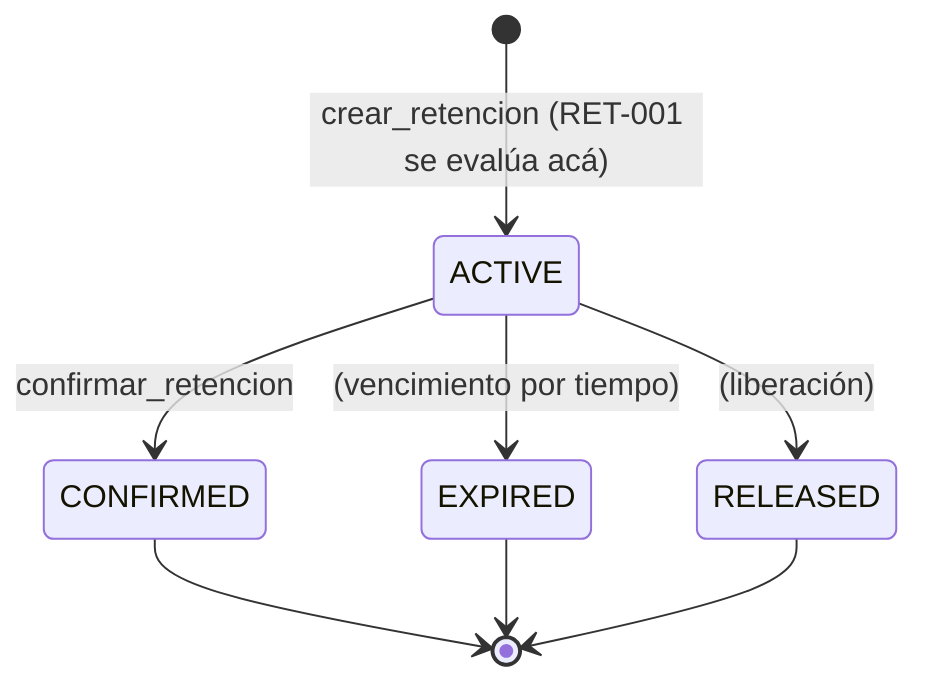

# Diagrama de estados de una retención (Hold)

Este diagrama está **derivado del código real**, no dibujado a priori.
La fuente de verdad son:

- `app/core/entities.py` → el enum `HoldStatus` (los estados posibles).
- `app/core/rules.py` y `app/application/use_cases.py` → las
  transiciones que hoy existen de verdad en el código.

Usar el diagrama como herramienta de **auditoría** (no solo de diseño
previo) significa preguntarse: *¿el diagrama refleja lo que el código
hace, o lo que nos gustaría que hiciera?* Las diferencias entre ambos
son información valiosa, no errores a esconder.

## Estados definidos en el código

Del enum `HoldStatus` (`app/core/entities.py`):

- `ACTIVE` — retención vigente.
- `CONFIRMED` — retención confirmada (pasa a reserva firme).
- `EXPIRED` — retención vencida por tiempo.
- `RELEASED` — retención liberada.

## Diagrama

## Auditoría: diagrama vs. código (estado actual)

Al comparar el diagrama con lo que el código realmente implementa hoy,
se ven diferencias que conviene dejar explícitas:

- **`ACTIVE --> CONFIRMED`**: implementada. `confirmar_retencion`
  existe en `use_cases.py` y en el endpoint `POST /holds/{id}/confirm`.
- **`ACTIVE --> EXPIRED`**: **no implementada todavía**. El estado
  `EXPIRED` existe en el enum, pero no hay código que expire retenciones
  por tiempo. Es una transición "declarada pero no realizada".
- **`ACTIVE --> RELEASED`**: **no implementada todavía**. Igual que
  `EXPIRED`: el estado existe, pero no hay operación que libere una
  retención.

Estas dos brechas (estados que existen en el enum pero sin transición
implementada) son un hallazgo típico de auditoría: el modelo declara más
de lo que el código cumple. No son bugs, son trabajo futuro — pero
tenerlos visibles evita que alguien asuma que ya funcionan.

## Actividad sugerida para el agente (Semana 2)

Pedirle al agente que **regenere este diagrama leyendo el código**
(`entities.py` + `use_cases.py`) y que lo compare con esta versión. Si el
agente produce un diagrama distinto, la diferencia es material de
discusión: ¿cambió el código?, ¿el agente infirió transiciones que no
existen?, ¿nosotros documentamos de más? Ese contraste es el ejercicio.
