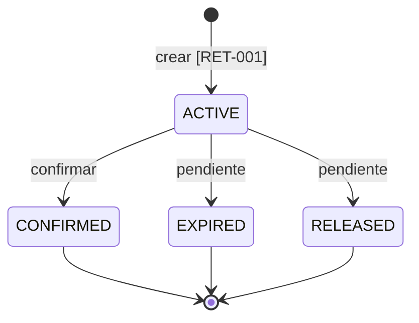

# Estados de una retención

Este archivo representa visualmente el código vigente. No define reglas nuevas.
Las reglas asociadas se referencian por identificador.

## Brechas detectadas

| Transición | Estado |
|---|---|
| `ACTIVE → CONFIRMED` | Implementada |
| `ACTIVE → EXPIRED` | Pendiente |
| `ACTIVE → RELEASED` | Pendiente |
