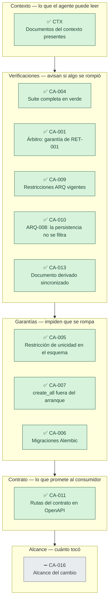

# Informe de evidencia — Semana 3

**10 de 11 verificaciones en verde** (0 en rojo, 1 sin evaluar).

## Detalle

| | ID | Verificación | Resultado |
|---|---|---|---|
| ✅ | `CTX` | Documentos del contexto presentes | todos presentes |
| ✅ | `CA-004` | Suite completa en verde | 21 passed, 1 deselected, 37 warnings in 1.70s |
| ✅ | `CA-001` | Árbitro: garantía de RET-001 | 5 passed, 13 warnings in 0.96s |
| ✅ | `CA-009` | Restricciones ARQ vigentes | 3 passed in 0.01s |
| ✅ | `CA-010` | ARQ-008: la persistencia no se filtra | sin violaciones |
| ✅ | `CA-013` | Documento derivado sincronizado | El diagrama commiteado coincide con el código. |
| ✅ | `CA-005` | Restricción de unicidad en el esquema | uq_holds_event_seat_active (parcial por estado) |
| ✅ | `CA-007` | create_all fuera del arranque | no aparece en main.py |
| ✅ | `CA-006` | Migraciones Alembic | 1 migración(es): 0001_add_holds_unique.py |
| ✅ | `CA-011` | Rutas del contrato en OpenAPI | todas presentes |
| ➖ | `CA-016` | Alcance del cambio | no se indicó --base; ejecutar con --base <commit> para medirlo |

## Qué NO dice este informe

Este informe reúne evidencia sobre propiedades concretas y verificables.
No dice nada sobre la legibilidad del código, la calidad de los mensajes
de error, el rendimiento, el comportamiento de la migración sobre datos
preexistentes inválidos, ni sobre la existencia de otras condiciones de
carrera en operaciones no cubiertas.

Un tablero en verde significa que el sistema es correcto **respecto de lo
que estas verificaciones comprueban**. Nada más, y nada menos.
